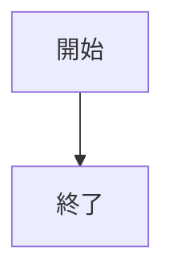
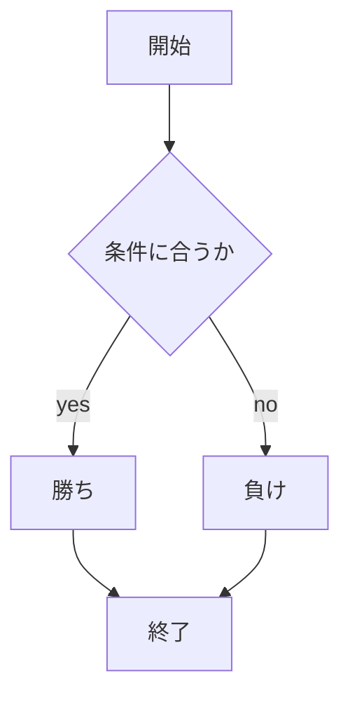

# webpro_06
10/29

## このプログラムについて

 ファイル一覧　|　説明
-|-
app5.js|プログラム本体
public/janken.html|じゃんけんの開始画面
views/janken.ejs|じゃんけんのテンプレートファイル
public/number_guess|数字当てゲームの開始画面
views/number_guess.ejs|数字当てゲームのテンプレートファイル
views/highlow.ejs|High & Low のテンプレートファイル

***
## じゃんけんについて

このゲームは，ユーザーが手を入力すると，コンピュータとじゃんけんの勝負を行い，勝敗を記録していく仕組みである．

[じゃんけんのサイト](http://localhost:8080/public/janken.html)

`app5.js`
-
**概要**
app5.jsはNode.jsとExpressフレームワークを使用して構築されたサーバーサイドのコードである．このコードは，静的ファイルを提供し，じゃんけんゲームのルート（/janken）にアクセスしたときにゲームの勝敗を判定し，その結果を表示するHTMLを返す．

**主な機能**
1. 静的ファイルの提供
- express.static()を使って，publicディレクトリ内のファイルを静的ファイルとして提供する．これにより，janken.htmlなどのHTMLファイルやJavaScriptファイルを簡単に提供できる．
```javascript
app.use(express.static(path.join(__dirname, 'public')));
```
2. ルート設定
- /ルートにアクセスがあった場合，janken.htmlを返す．
```javascript
app.get('/', (req, res) => {
    res.sendFile(path.join(__dirname, 'public', 'janken.html'));
});
```

3. じゃんけんゲーム
- /jankenルートで、ユーザーの手、勝数、合計試合数をリクエストパラメータとして受け取る．
- Math.random()を使ってコンピュータの手をランダムに選び，ユーザーと比較して勝敗を判定する．
- 判定結果，コンピュータの手，ユーザーの手，勝敗数と合計試合数をdisplayオブジェクトに格納し，janken.ejsテンプレートに渡す．
```javascript
app.get("/janken", (req, res) => {
    res.render('janken', display);
});
```

`janken.html`
- 
**概要**
このHTMLファイルは，ユーザーが最初にじゃんけんゲームをプレイするための入力画面である．

**主な機能**
1. フォームでユーザーの手を入力
- ユーザーはテキストフィールドにグー，チョキ，パーのいずれかを入力し，送信ボタンでフォームを送信する．
- 送信時，/jankenルートにGETリクエストが送信され，ユーザーの手の情報がサーバーに渡される．

`janken.ejs`
- 
**概要**
janken.ejsはEJSを使用したテンプレートファイルで，じゃんけんゲームの結果を表示するためのページである．app5.jsから渡されたdisplayオブジェクトを利用して，勝敗結果を動的に表示する．

**主な機能**
1. ユーザーの手，コンピュータの手，判定結果の表示
- ユーザーが入力した手，コンピュータが選んだ手，そして勝敗の判定結果が表示される．

- 現在までの試合数とユーザーの勝数も表示され，進捗が一目で分かる．

2. 次のじゃんけんの入力フォーム
- ユーザーは再度，グー，チョキ，パーを入力して「じゃんけん　ポン」ボタンで送信することで次の試合に進む．

### じゃんけんの使用手順
1. `app5.js`があるディレクトリを開く
1. `node app5.js` でプログラムを起動する
1. Webブラウザで localhost:8080/public/janken.htmlにアクセスする
1. 自分の手を入力する
1. janken.ejsページで勝敗結果を確認し，次の手を入力して再度じゃんけんを行う．勝数と合計試合数が継続して表示される．

***
## 数字当てゲームについて

このゲームは，1から100までのランダムな数字をユーザーが当てる数当てゲームである．サーバー側でランダムなターゲットナンバーを生成し，ユーザーが推測した数字を比較して結果を返す．

[数字当てゲームのサイト](http://localhost:8080/guess)


`app5.js`
-
**概要**
app5.jsはNode.jsとExpressフレームワークを使用して構築され，数当てゲームのロジックを処理する．サーバー側でランダムなターゲットナンバーを生成し，ユーザーの推測と比較して結果を返す仕組みである．

**主な機能**
1. ターゲットナンバーの生成
- Math.random()を使って、1から100までのランダムな整数を生成する．
```javascript
let targetNumber = Math.floor(Math.random() * 100 + 1); 
```

2. 推測回数と履歴の管理
- guesscount: 現在のゲームでの推測回数．

- history: ユーザーがこれまでに推測した数字のリスト．
```javascript
let guesscount = 0;
let history = [];
```

3. 数当てゲーム
- ユーザーの推測とターゲットナンバーを比較して，結果を決定する．

- 推測が小さければ「もっと大きいです」，大きければ「もっと小さいです」と表示する．

- 推測が正解の場合，ターゲットナンバーを再生成し，ゲームをリセットする．


4. 結果の表示
- number_guess.ejsテンプレートを使用して，ユーザーに現在の推測，メッセージ，推測回数，履歴を表示する．
```javascript
res.render('number_guess', { guess, message, guesscount, history });
```

`number_guess.html`
- 
**概要**
number_guess.htmlは，数当てゲームの初期画面を提供する静的HTMLファイルである．

**主な機能**
1. 推測入力フォーム
- 数字を入力するためのフォーム．ユーザーが入力した値は/guessルートにGETリクエストとして送信される．

`number_guess.gjs`

**概要**
number_guess.ejsは，数当てゲームの結果画面を提供する動的なテンプレートファイルである．ユーザーの推測結果とこれまでのゲーム履歴を表示する．

**主な機能**
1. ユーザーの推測と結果メッセージの表示
- ユーザーが入力した数字と，それに基づく結果を表示する．
2. 推測回数と履歴の表示
- ゲーム中の現在の推測回数と，これまでの推測履歴を表示する．
- 推測履歴がない場合は「まだありません」と表示される．
3. 次の挑戦用フォーム
- 数字を再入力して次の推測を行うためのフォームを表示する．入力された値は再び/guessルートに送信される．

### 数字当てゲームの使用手順
. `app5.js`があるディレクトリを開く
1. `node app5.js` でプログラムを起動する
1. Webブラウザで localhost:8080/guessにアクセスする
1. 予想する数字を入力し，推理ボタンを押す．
1. ユーザーの推測結果が表示さ，正解ならゲームがリセットされる．不正解ならもう一度予想する数字を入力する．


## High & Low について

このゲームは，ユーザーがHighまたはLowを選択してCPUの数値と比較し，勝敗を決める．

[High & Low のサイト](http://localhost:8080/highlow)

`app5.js`
- 
**概要**
このコードは，ランダムな数字を使ったHigh & Lowゲームのサーバーサイドロジックを提供する．ユーザーが次の試合でHighかLowを選択し，CPUの数字と比較して結果を出力する．

**主な機能**
1. ランダムな数値の生成
- CPUとプレイヤーそれぞれに1～13の範囲でランダムな数値を生成する．
```javascript
const cpuNum = Math.floor(Math.random() * 13) + 1;
const playerNum = Math.floor(Math.random() * 13) + 1;
```
2. 判定
- プレイヤーが選んだHighまたはLowに基づき，プレイヤーの数字とCPUの数字を比較して勝敗を決定する．
- 数字が等しい場合は「引き分け」とする．
3. 試合数と勝利数のカウント
- total：現在までの試合数
- win：勝利数
- total2：前回の試合数

4. データの表示
- highlow.ejsテンプレートを使い，現在の数字，選択，判定結果，試合数，勝数をユーザーに表示する．
```javascript
res.render('highlow', display);
```

`highlow.ejs`
-
**概要**
このテンプレートはゲーム結果を表示し，次の試合用のフォームを提供する．

**主な機能**
1. 現在のゲーム結果の表示
- CPUの数字とプレイヤーの数字を表示する．
- プレイヤーが選んだ選択肢とその判定結果を表示する．

2. 試合数と勝利数の表示
- 現在までの試合数と勝利数を表示する．

3. 次の試合用フォーム
- ユーザーがHighまたはLowを選択して次の試合に進むためのフォーム．

### High & Low の使用手順
. `app5.js`があるディレクトリを開く
1. `node app5.js` でプログラムを起動する
1. Webブラウザで localhost:8080/highlowにアクセスする
1. CPUの数字があなたの数字より High か Low かを選択し，「勝負！」ボタンを押す．
1. 続けてHighまたはLowを選択して，試合を繰り返し行える．

***
### Githubにフィアルをアップロードする方法
1. `git add .`
1. `git commit -am'例'`
1. `git push`
1. Githubのアクセストークンを入力する


***

```javascript
console.log('Hello');
```




